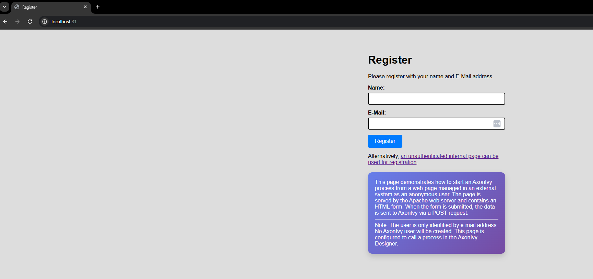
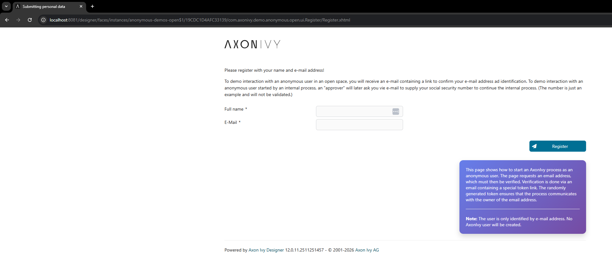
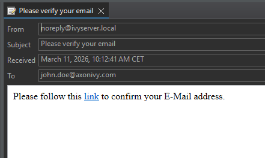
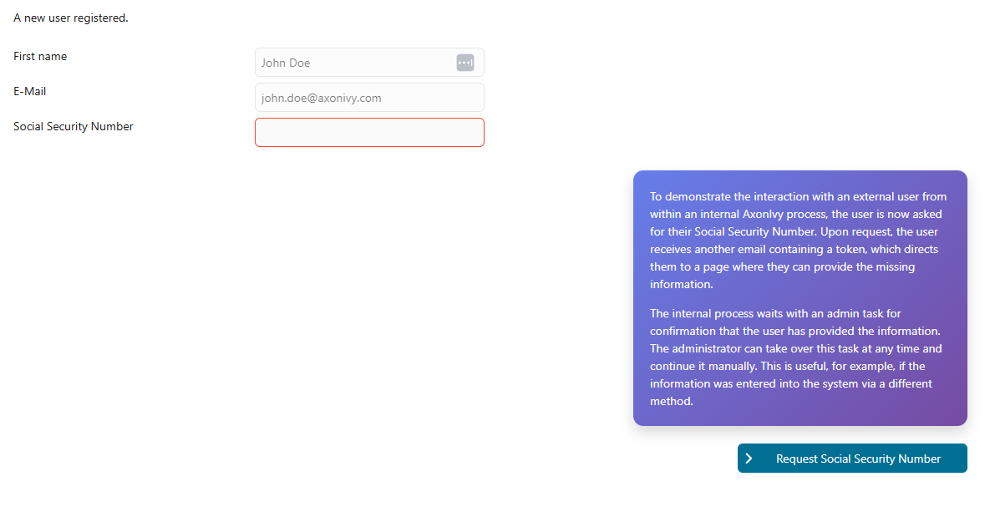
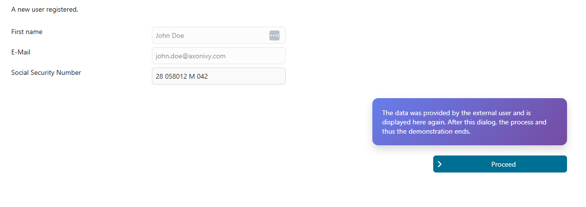

# Anonymous Demos

**Core idea**  
Instead of registering users for every external user, use e-mails with randomly generated and unguessable tokens.
All requests to external users are done via e-mails containing such tokens. Internal processes are started or
continued by sending them special signals.

**Use Cases**
* Start an unauthenticated process from Axon Ivy, verify the user's e-mail address and start an internal Axon Ivy process.
* Start an unauthenticated process from any web form on any external web-page via the form's `action` attribute and its POST request. Verify the user's e-mail address and start an internal Axon Ivy process.
* During a running internal process, interact with a user by e-mail and wait for their response efficiently.

## Demo

The demos show a fictional registration use-case, where an unauthenticated user enters his/her name and e-mail address to register. In the next step, the user's e-mail will be verified by sending a link with a random token to the user's e-mail address. The token is stored in the Axon Ivy *Business Data Repository* and if the user follows the token link, the token will be invalidated and an internal process is started by a signal.

For demonstration reasons, the internal process will be viewed by an approver who will find out, that some information of the external user is needed (their social security number). The approver requests the additional data from the external user with another token e-mail.

When the user follows the link in the e-mail, they will be shown a dialog where they can enter the missing data. After submission, the process continues. The external user will get a confirmation e-mail and the internal user get a task with overview page to show the completed data.

When the approver continues from this final dialog, the process will end.


**Workflow**  
All demo variants use the same workflow:

* Start the demo as unauthenticated user and enter name and e-mail address
    

    

* Wait for the verification email and follow the link in it.

    

* A task for the role `AnonymousUserApprover` will be created. In this task, additional data (social security number) will be requested from the external user.

    
* As unauthenticated user, open your e-mail to find the additional data request, follow the link and enter the missing data.
* You will receive an e-mail confirming the complete registration process.
* A final confirmation task for the role `AnonymousUserApprover` will be created. After continuing from this task, the demo ends
* A small variant shows how a user owning the role `AnonymousUserApprover` can skip the waiting for the external user to enter their additional data. This can be used to terminate waiting in case the additional information was entered manually by some other means.

    

**Scenarios**

The demos can be run in the following scenarios:

A. Standalone in the Axon Ivy Designer  

B. With the Apache Web Server and the Axon Ivy Designer  

C. With the Apache Web Server, the Axon Ivy Engine and a Test E-Mail Server

## Setup

***Variant A, Axon Ivy Designer***

Assuming your Axon Ivy Designer runs at the default port, open the link: http://localhost:8081/designer/pro/anonymous-demos-open/19C23640F9AD30D8/register.ivp to start the demo.

Open the *Email Messages* view in Axon Ivy Designer to see any e-mails generated.

To work on internal tasks, in a second browser open the workflow UI at http://localhost:8081 (or install the Portal if you like).

***Variant B, Apache WebServer and Axon Ivy Designer***

This variant uses docker containers to supply the demo environment. Make sure, you have docker installed, open a console or shell and go to the directory `anonymous-demos-extra/docker`

Start the containers with the command:

`docker-compose up -d`

This should start all containers.

Open the link http://localhost:81/ to start the demo.

Continue in the same way as in variant A.

***Variant C, Apache WebServer, Axon Ivy Engine, Smtp4Dev Email Test Server***

This variant uses the same docker environment as variant B which can be started in the same way, but requires a little more setup.

First, build the deployable file by right-clicking on the top-level `pom.xml` file and selecting `Run as... / Maven install`. This will start the build process and created a `zip` file in the `target`directory.

Next, go to the Demo Axon Ivy Engine at http://localhost:8080/ and open the Engine Cockpit.

Create a new application with the exact name `anonymous-demos` and deploy the `zip` file which was generated before.

Open the link http://localhost/ to start the demo.

To work on internal tasks, use the `anonymous_user_approver` (Password `password`) owning the role `AnonymousUserApprover` for most tasks or the `anonymous_user_admin` (Password `password`) owning the role `AnonymousUserAdmin` for the Admin task.

To see e-mails generated by the Axon Ivy Engine, open http://localhost:2580/ (no e-mails will be sent to the net).

### Open Project and Reverse Proxy Server Apache

The demos use an Apache Web Server as a Reverse Proxy. For security reasons, the Reverse Proxy will only forward requests to the `anonymous-demos-open` project (and certain needed accessories) to the internal Axon Ivy Engine (or Designer). Therefore external users will not be able to see the *Portal* or other parts of any application.

Note: In these demos, the Apache Web Server will in fact implement two different reverse proxy servers, one forwarding request to http://localhost:81/ to the Axon Ivy Designer and one forwarding requests to http://localhost/ to the Axon Ivy Engine.

```
@variables.yaml@
```